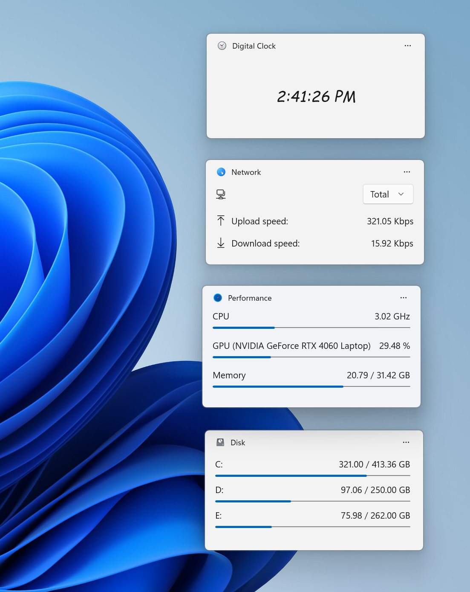
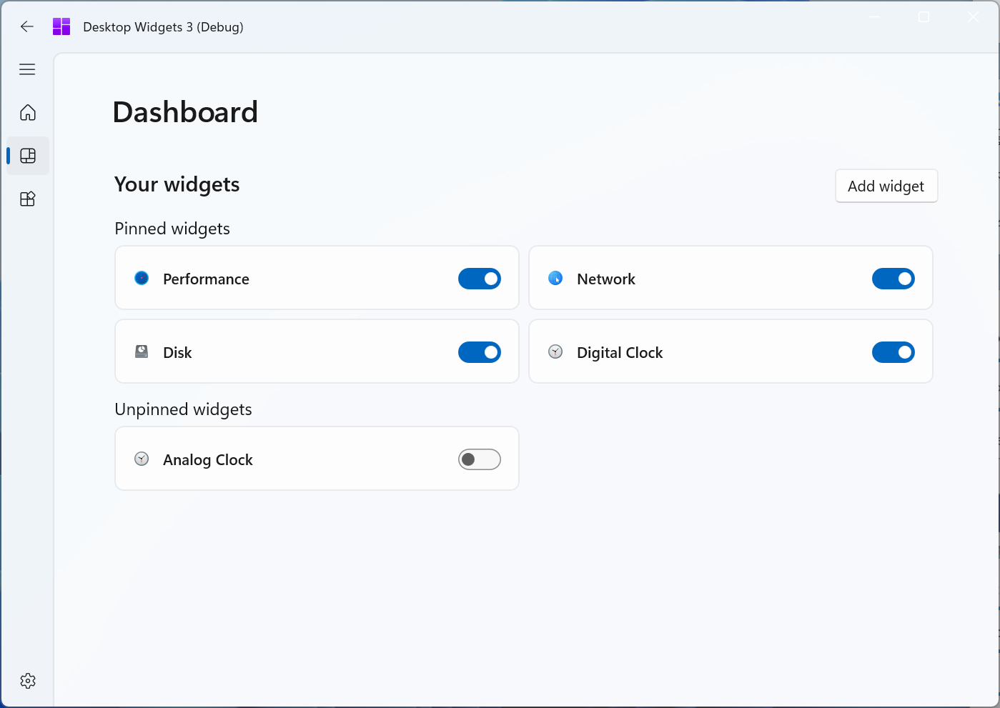
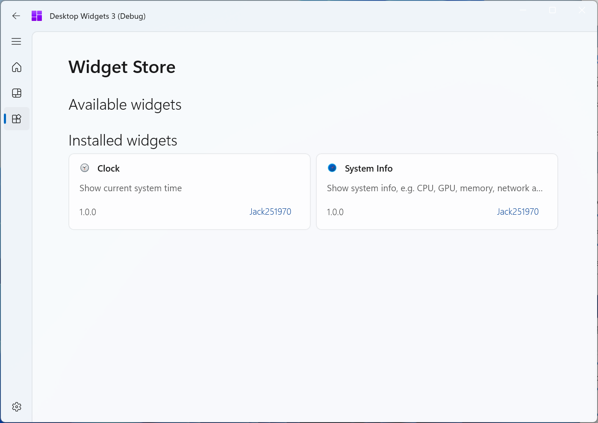
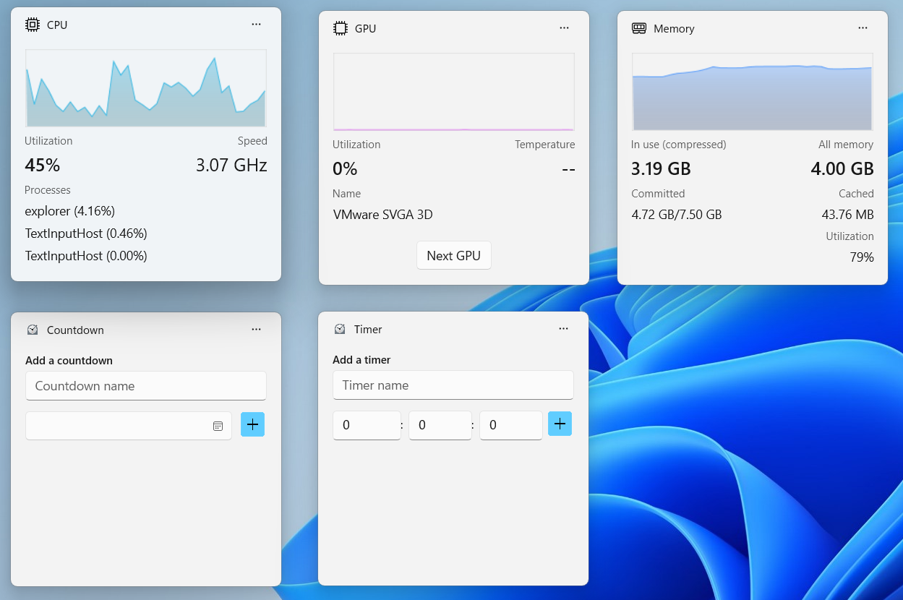
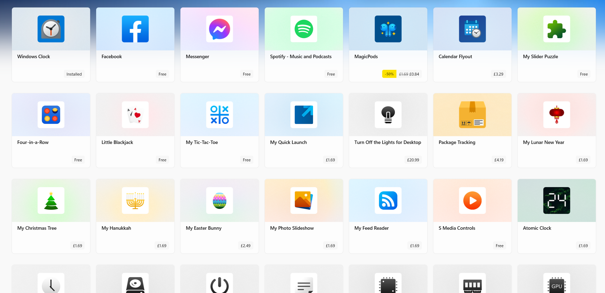

# Desktop Widgets 3

**An app for many useful desktop widgets based on WinUI 3 with support of widgets from Microsoft store.**

## ⭐ Features

### Show in desktop

<picture>
  <source media="(prefers-color-scheme: dark)" srcset="./images/Screenshot1-Dark.png">
  <source media="(prefers-color-scheme: light)" srcset="./images/Screenshot1.png">
  
</picture>

* Widgets will be shown in the desktop.

### Manage your widgets

<picture>
  <source media="(prefers-color-scheme: dark)" srcset="./images/Screenshot2-Dark.png">
  <source media="(prefers-color-scheme: light)" srcset="./images/Screenshot2.png">
  
</picture>

* You can pin, unpin & delete your widgets in the dashboard page. Also you can manage your widgets from their context menu.
* When clicking the widget item in the dashboard page, you can set settings for each widget.
* Enter edit mode to change the position of your pinned widgets from the `Edit widgets layout` item in their context menu.

### Install more widgets

<picture>
  <source media="(prefers-color-scheme: dark)" srcset="./images/Screenshot3-Dark.png">
  <source media="(prefers-color-scheme: light)" srcset="./images/Screenshot3.png">
  
</picture>

> [!IMPORTANT]
> Community widgets will be available in the future.

### Enable Microsoft widgets

<picture>
  <source media="(prefers-color-scheme: dark)" srcset="./images/Screenshot4-Dark.png">
  <source media="(prefers-color-scheme: light)" srcset="./images/Screenshot4.png">
  
</picture>

* Microsoft widgets are supported and you can pin them to the desktop.

<picture>
  <source media="(prefers-color-scheme: dark)" srcset="./images/Screenshot5-Dark.png">
  <source media="(prefers-color-scheme: light)" srcset="./images/Screenshot5.png">
  
</picture>

* You can install them from Microsoft Store.

## 🚀 Getting Started

### Build

* Forken the project.
* Select the package or unpackaged mode.
* Build the solution in Visual Studio or run `dotnet build` from the command line.

### Installer

> [!IMPORTANT]
> Installer will be available in the future.

## 📚 Reference

* CustomExtensions.WinUI: https://github.com/Jack251970/CustomExtensions.WinUI
* devhome: https://github.com/microsoft/devhome
* Files: https://github.com/files-community/Files
* Flow.Launcher: https://github.com/Flow-Launcher/Flow.Launcher
* fluentui-system-icons: https://github.com/microsoft/fluentui-system-icons
* H.NotifyIcon: https://github.com/HavenDV/H.NotifyIcon
* ICONS8: https://icons8.com/icons
* Newtonsoft.Json: https://github.com/JamesNK/Newtonsoft.Json
* PowerToys: https://github.com/microsoft/PowerToys
* Template Studio for WinUI (C#): https://github.com/microsoft/TemplateStudio
* terminal: https://github.com/microsoft/terminal
* WinUI3Windows: https://github.com/smourier/WinUI3Windows
* WinUI3-Template: https://github.com/Jack251970/WinUI3-Template
* Windows Community Toolkit: https://github.com/CommunityToolkit/WindowsCommunityToolkit
* WinUIEx: https://github.com/dotMorten/WinUIEx

## 📄 License

[GUN License](LICENSE)